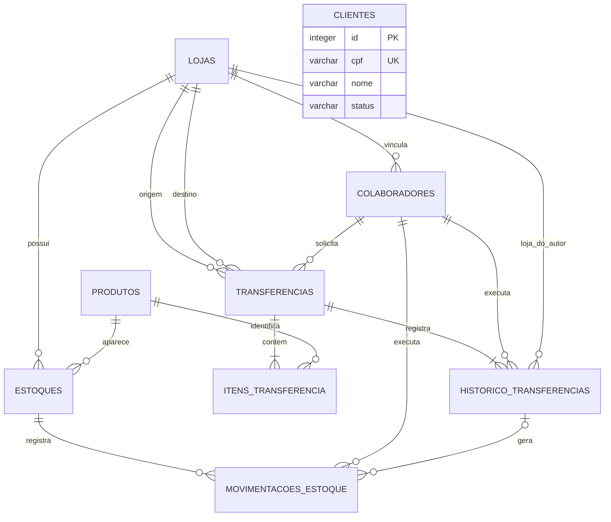

# Modelagem de Dados — V1 aprovada

**Status: modelagem aprovada pelo Roger, com ajustes consolidados nesta revisão.**

Este documento transforma os requisitos da [V1](V1-SISTEMA-VAREJO.md) em um modelo relacional para PostgreSQL. Os campos, tipos e decisões abaixo foram aprovados, incluindo os ajustes de unidade de medida e dados obrigatórios do cliente. Nenhum banco ou aplicação foi criado nesta etapa.

## 1. Como ler o modelo

- **Tabela:** conjunto de registros de um conceito, como produtos.
- **PK (chave primária):** identifica um registro sem repetição.
- **FK (chave estrangeira):** aponta para um registro de outra tabela.
- **UNIQUE:** impede valores ou combinações repetidas.
- **NOT NULL:** torna um campo obrigatório.
- **CHECK:** impede valores inválidos dentro do próprio registro.
- **Transação:** reúne alterações que devem ser confirmadas juntas ou desfeitas juntas.

Exemplo: `estoques.produto_id` aponta para `produtos.id`. Assim, o estoque identifica seu produto sem copiar o cadastro inteiro.

## 2. Decisões aprovadas

| Escolha | Decisão | Motivo e consequência |
|---|---|---|
| Identificadores | `integer` gerado automaticamente, como PK. | Facilita acompanhar registros durante o aprendizado; não substitui autorização na API. |
| Quantidades | Inteiros positivos nos itens; inteiros não negativos nos saldos. | A V1 trabalha com unidades inteiras. Produtos vendidos por peso, volume ou fração ficam para revisão futura. |
| Unidade de medida | Apenas `UN` (unidade). | Uma caixa pode ser um produto próprio, como “Caixa de camisas”, contado por unidade. Não há conversão entre caixas e peças. |
| Preço | `numeric(12,2)`, em reais, não negativo. | Representa um valor decimal exato com duas casas. |
| Datas | `timestamptz`, geradas pelo sistema. | Guardam instantes; telas mostram no fuso America/Sao_Paulo. |
| Status e tipos | `varchar` com `CHECK` para os valores permitidos. | Deixa os valores explícitos sem exigir tabelas de domínio nesta versão. |
| Exclusão | Inativação de cadastros; sem exclusão física pela aplicação. | Preserva vínculos e histórico, mesmo quando ainda não existe histórico. |
| Categoria | Texto no produto. | Evita um novo cadastro na V1; a API normaliza espaços e escrita. |
| Endereço | Campos na própria loja ou cliente. | Só há um endereço atual por cadastro; não exige outra tabela. |
| Histórico de transferência | Uma tabela adicional, `historico_transferencias`. | Registra autor, data e transição, inclusive etapas sem movimentação de saldo. |
| Histórico de reservas | Acrescentar `RESERVA` e `LIBERACAO_RESERVA` aos tipos de movimentação. | Torna explícito quando saldo é comprometido e liberado. |
| Estoque inexistente | Ausência da combinação produto/loja significa saldo zero na consulta. | Evita criar todos os pares antecipadamente; o registro surge na primeira operação necessária. |
| Itens da transferência | Imutáveis após a solicitação. | Para corrigir um pedido, administrador cancela antes do envio e cria-se outro pedido. Simplifica a consistência das reservas. |

**Escopo aprovado:** quantidades inteiras e unidade UN. Produtos vendidos por kg, litros ou metros fracionados exigirão revisão futura dos tipos e do critério de baixo estoque.

## 3. Visão dos relacionamentos



`||` significa exatamente um; `o{`, zero ou muitos; `|{`, um ou muitos; `o|`, zero ou um. Uma transferência deve ter pelo menos um item e um evento inicial; a API garante isso na transação de criação.

Clientes ficam independentes: a V1 não tem vendas ou outro fluxo que associe clientes às transferências. Não inventaremos esse vínculo.

## 4. Tabelas e campos

### 4.1. `lojas`

| Campo | Tipo | Obrigatório | Regra / finalidade |
|---|---|---|---|
| `id` | integer | Sim | PK automática. |
| `codigo` | varchar(30) | Sim | UNIQUE; identificação da unidade, como CENTRO. |
| `nome` | varchar(120) | Sim | Nome da loja. |
| `telefone` | varchar(20) | Não | Contato. |
| `logradouro` | varchar(150) | Não | Endereço. |
| `numero` | varchar(20) | Não | Aceita valores como S/N. |
| `complemento` | varchar(100) | Não | Complemento. |
| `bairro` | varchar(100) | Não | Bairro. |
| `cidade` | varchar(100) | Não | Cidade. |
| `uf` | varchar(2) | Não | Sigla validada pela API. |
| `cep` | varchar(8) | Não | Oito dígitos, sem pontuação. |
| `status` | varchar(10) | Sim | ATIVO ou INATIVO; padrão ATIVO. |
| `criado_em` | timestamptz | Sim | Data de criação. |
| `atualizado_em` | timestamptz | Sim | Atualizado a cada edição. |

**Proposta adicional:** bloquear inativação de loja com estoque físico, colaboradores ativos ou transferências abertas. Loja inativa continua visível no histórico, mas não participa de novas solicitações.

### 4.2. `produtos`

| Campo | Tipo | Obrigatório | Regra / finalidade |
|---|---|---|---|
| `id` | integer | Sim | PK automática. |
| `codigo` | varchar(50) | Sim | UNIQUE; código comum à rede. |
| `nome` | varchar(150) | Sim | Nome pesquisável. |
| `descricao` | text | Não | Informações adicionais. |
| `categoria` | varchar(80) | Não | Categoria simples. |
| `preco` | numeric(12,2) | Sim | Maior ou igual a zero. |
| `unidade_medida` | varchar(2) | Sim | Apenas UN; padrão UN. |
| `status` | varchar(10) | Sim | ATIVO ou INATIVO; padrão ATIVO. |
| `criado_em` | timestamptz | Sim | Data de cadastro. |
| `atualizado_em` | timestamptz | Sim | Data da última edição. |

Quantidade pertence a `estoques`, nunca a `produtos`. Código é normalizado em maiúsculas e sem espaços nas extremidades antes de salvar.

Inativação é bloqueada quando houver transferência aberta, conforme RN20. Produto inativo não entra em novas solicitações, mas seu saldo e histórico permanecem consultáveis. Propõe-se impedir alteração de unidade após existir estoque ou histórico, para não reinterpretar quantidades antigas.

### 4.3. `estoques`

| Campo | Tipo | Obrigatório | Regra / finalidade |
|---|---|---|---|
| `id` | integer | Sim | PK automática. |
| `loja_id` | integer | Sim | FK para lojas. |
| `produto_id` | integer | Sim | FK para produtos. |
| `quantidade_fisica` | integer | Sim | Padrão 0; maior ou igual a zero. |
| `quantidade_reservada` | integer | Sim | Padrão 0; entre zero e quantidade física. |
| `criado_em` | timestamptz | Sim | Criação do par produto/loja. |
| `atualizado_em` | timestamptz | Sim | Última mudança de saldo. |

Restrições no banco:

```text
UNIQUE (loja_id, produto_id)
CHECK (quantidade_fisica >= 0)
CHECK (quantidade_reservada >= 0)
CHECK (quantidade_reservada <= quantidade_fisica)
```

Não armazenar `quantidade_disponivel`: calcular `quantidade_fisica - quantidade_reservada` nas consultas. Isso evita três valores independentes que poderiam divergir.

Para mostrar todas as lojas de um produto, consultar lojas e associar seus estoques, tratando o par ausente como físico 0 e reservado 0. A combinação ausente também deve aparecer no relatório de saldo zero. Baixo estoque continua sendo **disponível exatamente 1**.

Um saldo inicial deve entrar por movimentação ENTRADA, com autor e motivo, inclusive nos dados de demonstração. Criar o par zerado não representa uma movimentação.

### 4.4. `clientes`

| Campo | Tipo | Obrigatório | Regra / finalidade |
|---|---|---|---|
| `id` | integer | Sim | PK automática. |
| `nome` | varchar(150) | Sim | Nome completo. |
| `cpf` | varchar(11) | Sim | UNIQUE, onze dígitos, imutável. |
| `telefone` | varchar(20) | Sim | Contato. |
| `email` | varchar(254) | Sim | Obrigatório; não é identificador de login; sem unicidade. |
| `logradouro` | varchar(150) | Sim | Endereço. |
| `numero` | varchar(20) | Sim | Número ou S/N. |
| `complemento` | varchar(100) | Não | Complemento. |
| `bairro` | varchar(100) | Sim | Bairro. |
| `cidade` | varchar(100) | Sim | Cidade. |
| `uf` | varchar(2) | Sim | UF. |
| `cep` | varchar(8) | Sim | Oito dígitos. |
| `status` | varchar(10) | Sim | ATIVO ou INATIVO; padrão ATIVO. |
| `criado_em` | timestamptz | Sim | Data de cadastro. |
| `atualizado_em` | timestamptz | Sim | Última edição. |

CPF é texto para preservar zeros iniciais. A API remove pontuação e valida formato e dígitos verificadores; o banco verifica onze dígitos e unicidade. A API rejeita alteração e um trigger no banco protege a imutabilidade. Inativação não libera o CPF para outro cadastro.

### 4.5. `colaboradores`

| Campo | Tipo | Obrigatório | Regra / finalidade |
|---|---|---|---|
| `id` | integer | Sim | PK automática. |
| `loja_id` | integer | Sim | FK para lojas; todo colaborador tem uma loja. |
| `nome` | varchar(150) | Sim | Nome do usuário. |
| `email` | varchar(254) | Sim | UNIQUE, normalizado em minúsculas; login. |
| `senha_hash` | text | Sim | Hash de senha; nunca senha em texto puro. |
| `perfil` | varchar(20) | Sim | FUNCIONARIO ou ADMINISTRADOR. |
| `status` | varchar(10) | Sim | ATIVO ou INATIVO; padrão ATIVO. |
| `criado_em` | timestamptz | Sim | Data de cadastro. |
| `atualizado_em` | timestamptz | Sim | Última edição. |

Colaborador inativo não executa operações. Mudança de loja ou perfil não altera eventos antigos: o histórico mantém a loja e o perfil que o autor tinha na ação. Senha hash não é devolvida nas respostas da API.

### 4.6. `transferencias`

| Campo | Tipo | Obrigatório | Regra / finalidade |
|---|---|---|---|
| `id` | integer | Sim | PK automática. |
| `origem_loja_id` | integer | Sim | FK para lojas. |
| `destino_loja_id` | integer | Sim | FK para lojas; diferente da origem. |
| `solicitante_id` | integer | Sim | FK para colaboradores. |
| `status` | varchar(15) | Sim | SOLICITADA, APROVADA, EM_TRANSITO, RECEBIDA, CONCLUIDA ou CANCELADA. |
| `duplicada_de_id` | integer | Não | FK para outra transferência; apenas rastreia a duplicação. |
| `observacao` | text | Não | Observação do pedido. |
| `solicitada_em` | timestamptz | Sim | Data da criação; padrão atual. |
| `concluida_em` | timestamptz | Não | Preenchida apenas ao concluir. |
| `atualizado_em` | timestamptz | Sim | Última transição. |

Banco: origem diferente de destino; duplicação não pode apontar para si mesma; `concluida_em` deve estar preenchida se e somente se status for CONCLUIDA. Datas e autores de aprovação, envio, recebimento e cancelamento ficam no histórico.

Duplicar copia origem, destino e itens para **um novo pedido**, com novo solicitante, data e status SOLICITADA. Não copia reservas, movimentações, eventos ou conclusão. A criação depende de confirmação e novas validações.

**Proposta:** origem, destino e itens ficam imutáveis após criar. A V1 permite acompanhar e executar transições, sem edição do pedido existente.

### 4.7. `itens_transferencia`

| Campo | Tipo | Obrigatório | Regra / finalidade |
|---|---|---|---|
| `id` | integer | Sim | PK automática. |
| `transferencia_id` | integer | Sim | FK para transferências. |
| `produto_id` | integer | Sim | FK para produtos. |
| `quantidade` | integer | Sim | Maior que zero. |

Banco: `UNIQUE (transferencia_id, produto_id)` e `CHECK (quantidade > 0)`. Cada produto aparece uma vez no pedido. A API rejeita produtos repetidos no envio dos dados, com mensagem para corrigir a quantidade em uma única linha.

Não armazenar preço no item: a transferência movimenta mercadorias e não representa venda. Não há quantidade enviada ou recebida separada porque o fluxo é integral.

### 4.8. `historico_transferencias` — tabela adicional proposta

| Campo | Tipo | Obrigatório | Regra / finalidade |
|---|---|---|---|
| `id` | integer | Sim | PK automática. |
| `transferencia_id` | integer | Sim | FK para transferências. |
| `status_anterior` | varchar(15) | Não | Nulo somente no evento inicial. |
| `status_novo` | varchar(15) | Sim | Status após a ação. |
| `colaborador_id` | integer | Sim | FK para autor da ação. |
| `loja_autor_id` | integer | Sim | FK para loja do autor no momento da ação. |
| `perfil_autor` | varchar(20) | Sim | Perfil do autor no momento da ação. |
| `motivo` | text | Não | Obrigatório no cancelamento, como proposta. |
| `ocorrido_em` | timestamptz | Sim | Data do evento. |

O banco limita os pares de status a: nulo → SOLICITADA; SOLICITADA → APROVADA ou CANCELADA; APROVADA → EM_TRANSITO ou CANCELADA; EM_TRANSITO → RECEBIDA; RECEBIDA → CONCLUIDA.

Propõe-se `UNIQUE (transferencia_id, status_novo)`, pois o fluxo da V1 nunca retorna a um status anterior. A API verifica também se `status_anterior` corresponde ao estado atual, sob bloqueio da transferência. Dados de autor, loja e perfil vêm do usuário autenticado, nunca de campos enviados livremente pelo frontend.

Histórico é somente de acréscimo: não permite edição nem exclusão pela aplicação. A tabela registra ações efetivadas; tentativas recusadas ficam nos logs da API, sem inventar uma transição realizada.

### 4.9. `movimentacoes_estoque`

| Campo | Tipo | Obrigatório | Regra / finalidade |
|---|---|---|---|
| `id` | integer | Sim | PK automática. |
| `estoque_id` | integer | Sim | FK para estoques; identifica produto e loja. |
| `tipo` | varchar(25) | Sim | ENTRADA, SAIDA, AJUSTE, RESERVA, LIBERACAO_RESERVA, TRANSFERENCIA_SAIDA ou TRANSFERENCIA_ENTRADA. |
| `delta_fisico` | integer | Sim | Variação física com sinal; padrão 0. |
| `delta_reservado` | integer | Sim | Variação da reserva com sinal; padrão 0. |
| `evento_transferencia_id` | integer | Não | FK para histórico de transferências; obrigatório nas movimentações de transferência. |
| `colaborador_id` | integer | Sim | FK para quem executou a operação. |
| `motivo` | text | Não | Obrigatório em ENTRADA, SAIDA e AJUSTE manuais, como proposta. |
| `ocorrido_em` | timestamptz | Sim | Data da movimentação. |

**Delta é a diferença causada pela operação.** `+4` soma quatro; `-4` remove quatro. O efeito de uma movimentação fica explícito nos dois saldos:

| Tipo | Delta físico | Delta reservado | Vínculo com evento |
|---|---|---|---|
| ENTRADA | Positivo | 0 | Sem evento; manual. |
| SAIDA | Negativo | 0 | Sem evento; manual. |
| AJUSTE | Positivo ou negativo, diferente de zero | 0 | Sem evento; manual. |
| RESERVA | 0 | Positivo | Aprovação, estoque da origem. |
| LIBERACAO_RESERVA | 0 | Negativo | Cancelamento de pedido aprovado, estoque da origem. |
| TRANSFERENCIA_SAIDA | Negativo | Mesmo valor negativo | Envio, estoque da origem. |
| TRANSFERENCIA_ENTRADA | Positivo | 0 | Recebimento, estoque do destino. |

Essas combinações de sinais e presença de evento são protegidas por `CHECK`. Para transferência, a API confere também produto, loja, quantidade e autor contra o item e evento; isso envolve outras tabelas e não cabe em um `CHECK` simples.

Não há campo `quantidade` redundante: para exibir a quantidade movimentada, usar o valor absoluto do delta físico ou, em reserva/liberação, do delta reservado. Produto, loja e transferência são recuperados pelos relacionamentos.

Uma saída de transferência é **uma única movimentação** que diminui físico e reservado. Não gerar outra LIBERACAO_RESERVA no envio, pois diminuiria a reserva duas vezes.

Propõe-se unicidade de `(evento_transferencia_id, estoque_id)` quando o evento estiver preenchido. Há apenas uma movimentação por produto/loja em cada etapa. Movimentações manuais podem repetir nesse estoque, pois não têm evento. Histórico de estoque não pode ser editado ou excluído pela aplicação; correções usam nova movimentação com motivo.

**Permissão aprovada:** SAIDA manual segue ENTRADA/AJUSTE: administrador com motivo obrigatório. Não é um módulo de vendas.

## 5. Exemplo completo para conferir o modelo

Produto Notebook em UN. Centro começa com físico 5, reservado 0; Barra com físico 0, reservado 0. O saldo inicial do Centro tem uma ENTRADA de +5 registrada.

Transferência de 4 unidades:

| Ação | Status | Centro: físico/reservado/disponível | Barra: físico/reservado/disponível | Novas movimentações |
|---|---|---|---|---|
| Solicitar | SOLICITADA | 5 / 0 / 5 | 0 / 0 / 0 | Nenhuma. |
| Aprovar | APROVADA | 5 / 4 / 1 | 0 / 0 / 0 | RESERVA: físico 0, reservado +4 na origem. |
| Enviar | EM_TRANSITO | 1 / 0 / 1 | 0 / 0 / 0 | TRANSFERENCIA_SAIDA: físico -4, reservado -4 na origem. |
| Receber | RECEBIDA | 1 / 0 / 1 | 4 / 0 / 4 | TRANSFERENCIA_ENTRADA: físico +4, reservado 0 no destino. |
| Concluir | CONCLUIDA | 1 / 0 / 1 | 4 / 0 / 4 | Nenhuma. |

Cada linha gera um evento no histórico da transferência, inclusive solicitar e concluir. Centro aparece em baixo estoque após aprovar, enviar, receber e concluir, pois seu disponível é 1.

**Caminho alternativo:** cancelar após aprovação gera LIBERACAO_RESERVA de -4 e restaura o disponível do Centro para 5, mantendo físico 5. Cancelar ainda em SOLICITADA gera evento de cancelamento, sem movimentação de estoque.

## 6. O que o banco garante e o que a API precisa fazer

| Proteção | Responsabilidade proposta |
|---|---|
| IDs existentes nos relacionamentos | FKs no banco, com exclusão restrita (`ON DELETE RESTRICT`). |
| CPF, login, código e pares únicos | UNIQUE no banco; API apresenta erro compreensível. |
| Campos obrigatórios, status válidos, origem diferente, sinais e saldos válidos | NOT NULL e CHECK no banco; validação prévia na API. |
| CPF imutável | API e trigger no banco. |
| Ao menos um item e histórico inicial | API cria tudo na mesma transação. |
| Perfil, loja e usuário ativo | API com base na identidade autenticada. |
| Produto ativo, unidade fixa e bloqueio de inativação | API; operações de criação de pedido e inativação bloqueiam os produtos envolvidos para evitar disputa. |
| Transições legais e correspondência entre item, evento e saldo | API dentro de transação, com bloqueios. |
| Reserva total igual aos itens de transferências APROVADAS | Serviço de transferência mantém o saldo; consulta de conferência verifica divergências. |
| Movimento, evento, saldo e status coerentes | Mesma transação; se qualquer gravação falhar, desfazer tudo. |
| Histórico e pedidos imutáveis | API não oferece edição; permissões do usuário de banco restringem edição/exclusão de históricos. |

Um `CHECK` do PostgreSQL não substitui regras que consultam outras linhas ou tabelas. Por isso, impedir estoque negativo é necessário, mas não basta para garantir todas as regras de transferência. [Referência: restrições no PostgreSQL](https://www.postgresql.org/docs/current/ddl-constraints.html).

### Aprovar com segurança

1. Iniciar transação e bloquear a linha da transferência.
2. Conferir usuário, status SOLICITADA e todos os itens.
3. Bloquear os estoques da origem, em ordem de ID, com `SELECT ... FOR UPDATE`.
4. Recalcular disponíveis dentro da transação; um par ausente tem saldo zero.
5. Se faltar saldo em qualquer item, desfazer a operação inteira.
6. Atualizar reservas, criar evento e movimentações, mudar status para APROVADA.
7. Confirmar tudo junto.

O bloqueio das linhas faz outra operação que modifica esses mesmos saldos aguardar. A ordem consistente de bloqueios ajuda a evitar deadlocks, que são esperas circulares entre transações; a implementação também deve tratar esse erro. [Referência: bloqueios no PostgreSQL](https://www.postgresql.org/docs/current/explicit-locking.html).

Envio, recebimento, cancelamento, entradas e ajustes seguem a mesma disciplina de transação e bloqueio. No recebimento, criar o par de estoque do destino, se faltar, com inserção que trate conflito na chave única; depois bloquear o registro e somar. Dois recebimentos diferentes podem chegar ao mesmo produto/loja ao mesmo tempo.

Repetir envio ou recebimento deve retornar que a etapa já ocorreu ou conflito de status, sem gravar novamente. Bloqueio da transferência, verificação de estado e unicidade de eventos/movimentações trabalham juntos. Não prometemos impedir pedidos novos duplicados por dois cliques: uma chave de idempotência para criação pode ser definida na etapa da API.

## 7. Índices iniciais propostos

PKs e UNIQUE já criam seus índices. Os demais devem atender consultas concretas:

- `estoques (produto_id, loja_id)`: localizar estoque de um produto em todas as lojas; complementa o UNIQUE que começa por loja.
- `transferencias (origem_loja_id, status, solicitada_em)` e `(destino_loja_id, status, solicitada_em)`: acompanhar pedidos por unidade.
- `itens_transferencia (produto_id)`: verificar transferências abertas de um produto.
- `historico_transferencias (transferencia_id, ocorrido_em)`: mostrar a linha do tempo.
- `movimentacoes_estoque (estoque_id, ocorrido_em)`: consultar histórico do produto na loja.

Busca parcial por nome deve ser medida com o volume definido para o teste. Um índice simples de nome não deve ser tratado como garantia de acelerar toda pesquisa por trecho; ajustar a estratégia depois de medir. Não adicionar extensão ou índice especializado nesta proposta.

## 8. Cenários de validação para a implementação

| Cenário | Resultado esperado |
|---|---|
| Criar dois estoques do mesmo produto na mesma loja | Banco rejeita duplicação. |
| Consultar produto numa loja sem registro de estoque | Mostrar físico, reservado e disponível iguais a zero. |
| Criar CPF repetido ou alterar CPF | Operação recusada; cadastro original preservado. |
| Aprovar dois pedidos simultâneos de 4 com físico 5 | Apenas um aprovado; reservado 4; disponível 1. |
| Aprovar vários itens com um sem saldo | Nenhuma reserva, movimento ou mudança de status. |
| Falhar ao gravar evento ou movimento | Desfazer também saldo e status. |
| Enviar ou receber duas vezes, inclusive simultaneamente | Saldo muda uma vez; um evento e um movimento por item na etapa. |
| Receber duas transferências diferentes no mesmo par ainda ausente | Criar um único estoque e somar os dois recebimentos sem perder saldo. |
| Ajustar físico para valor abaixo do reservado | Bloquear, mantendo a reserva existente. |
| Inativar produto enquanto outro usuário solicita transferência | Serializar as ações; não criar pedido com produto já inativo nem inativar produto com pedido aberto. |
| Administrador de outra loja tenta enviar | Recusar sem qualquer alteração. |
| Cancelar pedido aprovado | Liberar reservas; manter físico; registrar autor e evento. |
| Concluir transferência | Registrar autor e data; não movimentar saldo. |
| Produto com disponível 1 ou 0 | Classificar respectivamente como baixo estoque ou sem estoque disponível. |

## 9. Revisão concluída

- [x] Quantidades inteiras e apenas UN, inclusive para um produto cadastrado como caixa.
- [x] Cliente: nome, CPF, telefone, e-mail e endereço principal obrigatórios; complemento opcional.
- [x] Colaborador: dados de login e vínculo com loja; sem telefone ou endereço residencial na V1.
- [x] Categoria como texto padronizado e preço único por produto para toda a rede.
- [x] Login por e-mail e um único vínculo de loja por colaborador.
- [x] Tabela adicional de histórico e tipos RESERVA/LIBERACAO_RESERVA.
- [x] Impedir edição de origem, destino e itens após solicitar.
- [x] Motivo obrigatório para cancelar e SAIDA manual por administrador com motivo.
- [x] Proteções para inativação de lojas e mudança de unidade de produto.

Continuam em aberto o tratamento de perdas/divergências após envio e as condições do teste de desempenho. A aprovação desta modelagem não define esses procedimentos. Não há novas tabelas para ocorrências, vendas, fornecedores, notificações ou cloud nesta etapa.

## 10. Próxima etapa e foco do aprendizado

Criar o ambiente local, o backend e migrations com dados de demonstração. Escolher a ferramenta de acesso ao banco na configuração do backend.

Roger já conhece SQL; não precisa de uma trilha introdutória de tabelas, chaves ou consultas. O foco de aprendizado será testes automatizados, AWS e Cloud.

A primeira entrega deve permitir executar e testar uma parte da API com PostgreSQL. Testes unitários acompanham regras relevantes; testes de integração verificam transações, rollback, concorrência e repetição de operações com banco real. Os cenários da seção 8 orientam a implementação.

Depois, automatizar validação em CI e introduzir laboratórios de Cloud ligados a necessidades do projeto, conforme a trilha de estudos. A revisão da modelagem está encerrada; a implementação ainda não começou.

Referência sobre o tipo decimal proposto para preço: [tipos numéricos do PostgreSQL](https://www.postgresql.org/docs/current/datatype-numeric.html).
